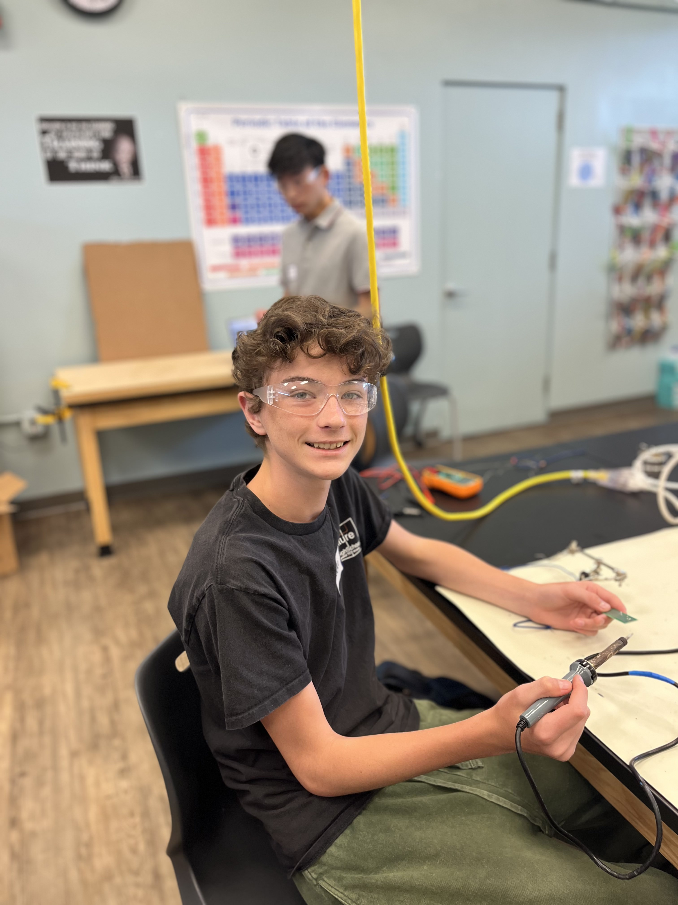
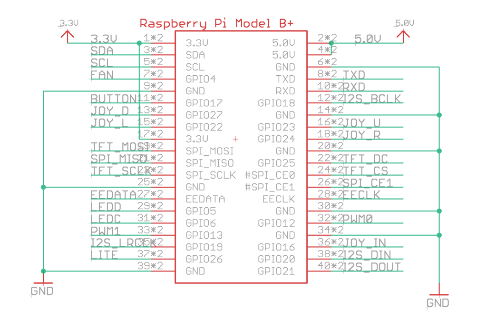

# Tensorflow Object Detector
My project is an object detection system. To use the project, you place the object in front of the attatched camera, and the system will identify the object and print out that guess. It uses the raspberry pi system attached to a Braincraft Hat to display the detections on the screen. There is an external camera for the recording of the object, as there is no built in camera for the Braincraft Hat. 

<!--- You should comment out all portions of your portfolio that you have not completed yet, as well as any instructions: -->


| **Engineer** | **School** | **Area of Interest** | **Grade** |
|:--:|:--:|:--:|:--:|
| Jake N | Gunn | Electrical and Computer Engineering | Incoming Senior

<!--**Replace the BlueStamp logo below with an image of yourself and your completed project. Follow the guide [here](https://tomcam.github.io/least-github-pages/adding-images-github-pages-site.html) if you need help.**   -->

<!---  -->


 # Final Milestone
<!--   **Don't forget to replace the text below with the embedding for your milestone video. Go to Youtube, click Share  Embed, and copy and paste the code to replace what's below.** -->

<iframe width="560" height="315" src="https://www.youtube.com/embed/zEZe-Us_2-w?si=88xVcjys6cefbscA" title="YouTube video player" frameborder="0" allow="accelerometer; autoplay; clipboard-write; encrypted-media; gyroscope; picture-in-picture; web-share" referrerpolicy="strict-origin-when-cross-origin" allowfullscreen></iframe>
The final milestone of the project was to complete the object detection. Using Tensorflow, I was able to set the camera to detect objects. Tensorflow has a database, so I did not have to train the ai model, but it is possible to improve the detection system through further training. I plan to modify the project in a different way, by integrating the system with a robot, allowing the robot to move based on the detections of the ai software. 

  Some of the challenges with this system came from linux and the raspberry pi. It was my first time dealing with both of them, so much of the things I had to do to set up the systems were brand new. As I got more familiar with both systems it became easier to coplete the project

  My biggest accomplishment for this project was getting the LCD display to function, as once the lcd display functioned, I had gained a lot of experience with linux through the time it took to get the LCD to work, and the rest of the project was much easier to complete.

  I hope to learn more about linux using a Virtualbox, I hope to learn about how to control servos using the Tensorflow software, and I want to just gain experience with hardware through my mods
  
<!--- For your final milestone, explain the outcome of your project. Key details to include are:
- What you've accomplished since your previous milestone
- What your biggest challenges and triumphs were at BSE
- A summary of key topics you learned about
- What you hope to learn in the future after everything you've learned at BSE    --->


# Second Milestone


<iframe width="560" height="315" src="https://www.youtube.com/embed/x2qqPhE9mOY?si=CU2d3d706k3Kq0zh" title="YouTube video player" frameborder="0" allow="accelerometer; autoplay; clipboard-write; encrypted-media; gyroscope; picture-in-picture; web-share" referrerpolicy="strict-origin-when-cross-origin" allowfullscreen></iframe>


Since the First Milestone, I was able to get the AI element of the project working. The main changes from the first milestone are:

  - The wiring
      - Switching out the mess of individual wires for a single ribbon cable made the device easier to troubleshoot and made the process easier
  - The AI system
      - The setup of the AI system made the object detection possible. I did this by installing Tensorflow, and using commands to run the AI system.
      - I struggled with the setup of the Tensorflow system. By following the instructions exactly, I was getting arrows. At this point I needed the help of instructors, and to help solve this problem, they had to use their own experience with linux to find solutions that the instructions did not mention. After getting Tensorflow set up, it was smooth sailing to the end, where I was able to get the system running.

The next step in my project will be the audio system, where the system will be able to say what the system detects using the linux audio systems. 


# First Milestone


<iframe width="560" height="315" src="https://www.youtube.com/embed/x42fLah2oPk?si=IGls7z8FMfvzWa6T" title="YouTube video player" frameborder="0" allow="accelerometer; autoplay; clipboard-write; encrypted-media; gyroscope; picture-in-picture; web-share" referrerpolicy="strict-origin-when-cross-origin" allowfullscreen></iframe>


My first milestone included setting up the raspberry pi, setting up the camera, and then connecting the LCD display.

At the beginning, I struggled with getting the pi set up, but when I switched from a 32 bit os to a 64 bit os, I was able to get the system to work. After getting the initial setup working, the rest of the milestone was far easier

I was able to get the camera working by manually wiring each pin to its counterpart, and when I fixed the issue of the pi constantly disconnecting, the system worked

The next step in the project is to get the AI systems set up so that the camera can detect objects and label them

# Starter Project
<iframe width="560" height="315" src="https://www.youtube.com/embed/c17OwP32b1U?si=thviAxQ3rvXzbX2C" title="YouTube video player" frameborder="0" allow="accelerometer; autoplay; clipboard-write; encrypted-media; gyroscope; picture-in-picture; web-share" referrerpolicy="strict-origin-when-cross-origin" allowfullscreen></iframe>

I chose the calculator as a starter project mostly randomly, but it turned out to be a great choice, as it was perfect for learning soldering and it was similar to my main project. My biggest challenge in the project was inexperience with soldering. I had to solder sections where all the pins were close together, and being so new, I struggled with making sure that all the pins were soldered correctly while also confirming that I did not connect pines that should be separate. Otherwise the project went smoothly and I finished quickly. One thing that helped me finish quickly was working with other people. Whenever I got stuck, after I tried troubleshooting I would ask those around me for help. By asking for help and giving help when asked, myself and those around me were able to pass roadblocks and finish the project more quickly and efficiently.


# Schematics 

<!--Here's where you'll put images of your schematics. [Tinkercad](https://www.tinkercad.com/blog/official-guide-to-tinkercad-circuits) and [Fritzing](https://fritzing.org/learning/) are both great resoruces to create professional schematic diagrams, though BSE recommends Tinkercad becuase it can be done easily and for free in the browser. -->

Image from:https://learn.adafruit.com/adafruit-braincraft-hat-easy-machine-learning-for-raspberry-pi/pinouts

<!-- # Code
Here's where you'll put your code. The syntax below places it into a block of code. Follow the guide [here]([url](https://www.markdownguide.org/extended-syntax/)) to learn how to customize it to your project needs. 

```c++
void setup() {
  // put your setup code here, to run once:
  Serial.begin(9600);
  Serial.println("Hello World!");
}

void loop() {
  // put your main code here, to run repeatedly:

}
```

-->
# Bill of Materials
<!--
Here's where you'll list the parts in your project. To add more rows, just copy and paste the example rows below.
Don't forget to place the link of where to buy each component inside the quotation marks in the corresponding row after href =. Follow the guide [here]([url](https://www.markdownguide.org/extended-syntax/)) to learn how to customize this to your project needs. -->

| **Part** | **Note** | **Price** | **Link** |
|:--:|:--:|:--:|:--:|
| Adafruit BrainCraft HAT - Machine Learning for Raspberry Pi 4 | Display | 44.95 | <a href="https://www.adafruit.com/product/4374"> Link </a> |
| Raspberry Pi 4 Model B - 4 GB RAM | Brain of project, is the computer the system runs on | $45 | <a href="https://www.adafruit.com/product/4296"> Link </a> |
| Raspberry Pi Camera Module 3 Standard - 12MP Autofocus | System camera | $25 | <a href="https://www.adafruit.com/product/5657"> Link </a> |
| Miniature 5V Cooling Fan for Raspberry Pi | Cooling so the system does not overheat | $3.50 | <a href="https://www.adafruit.com/product/3368"> Fan </a> |

<!--- # Other Resources/Examples
One of the best parts about Github is that you can view how other people set up their own work. Here are some past BSE portfolios that are awesome examples. You can view how they set up their portfolio, and you can view their index.md files to understand how they implemented different portfolio components.
- [Example 1](https://trashytuber.github.io/YimingJiaBlueStamp/)
- [Example 2](https://sviatil0.github.io/Sviatoslav_BSE/)
- [Example 3](https://arneshkumar.github.io/arneshbluestamp/)

To watch the BSE tutorial on how to create a portfolio, click here. -->
